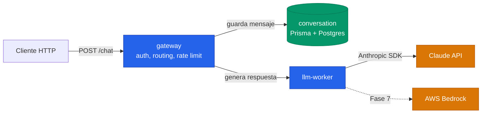

# LLM Agent Mesh

> Agente conversacional basado en LLM. Arquitectura de microservicios Node/TypeScript, desplegada en Kubernetes, con observabilidad, resiliencia y service mesh.

Proyecto de aprendizaje que toca las principales áreas de una arquitectura distribuida moderna: **microservicios, Kubernetes, cloud (AWS), LLMs / Generative AI, tracing distribuido, circuit breakers y service mesh**.

---

## Arquitectura



**Observabilidad**: OpenTelemetry -> Jaeger (traces), pino (logs estructurados)
**Resiliencia**: opossum (circuit breakers), retries, timeouts, healthchecks
**Service mesh**: Linkerd en el namespace principal + Istio en lab separado

---

## Stack

| Capa            | Tecnologia                                |
| --------------- | ----------------------------------------- |
| Runtime         | Node.js 20 + TypeScript strict            |
| HTTP            | Express                                   |
| DB              | PostgreSQL + Prisma                       |
| Validacion      | Zod                                       |
| Logs            | pino                                      |
| Tests           | Jest + supertest                          |
| Monorepo        | npm workspaces                            |
| Contenedores    | Docker multi-stage                        |
| Orquestacion    | Kubernetes (minikube en local)            |
| Tracing         | OpenTelemetry + Jaeger                    |
| Circuit breaker | opossum                                   |
| Service mesh    | Linkerd + Istio (lab)                     |
| LLM             | Claude API (Anthropic) + stub AWS Bedrock |

---

## Estado actual

**Fase 0 — Setup, decisiones y tooling** (en progreso)

- [x] Monorepo con npm workspaces
- [x] TypeScript strict (base config compartida)
- [x] Prettier + ESLint flat config (con `no-explicit-any: error`)
- [x] .gitignore + .env.example
- [ ] Husky + lint-staged (pre-commit hook)
- [ ] GitHub Actions CI

Fases 1-8 pendientes. Ver `tasks/roadmap.md` y `tasks/todo.md` para el plan completo.

---

## Estructura del monorepo

```
llm-agent-mesh/
├── package.json               # workspaces config
├── tsconfig.base.json         # TypeScript compartido
├── eslint.config.mjs          # flat config ESLint 9+
├── .prettierrc
├── .env.example
├── services/                  # microservicios (Fase 1)
│   ├── gateway/
│   ├── conversation/
│   └── llm-worker/
├── packages/                  # codigo compartido
│   └── shared/                # tipos y constantes
├── k8s/                       # manifests Kubernetes (Fase 2)
├── docs/                      # diagramas y notas
└── tasks/                     # roadmap y plan vivo
    ├── roadmap.md
    ├── todo.md
    ├── lessons.md
    └── setup-claude-api.md
```

---

## Setup local

> En la Fase 0 solo hay tooling. Los microservicios llegan en la Fase 1.

```bash
# Requisitos: Node 20+, npm 10+
npm install

# Verificacion
npm run format:check
npm run lint
```

Cuando esten los servicios (Fase 1 en adelante):

```bash
# Copiar variables de entorno
cp .env.example .env
# Editar .env (opcional: ANTHROPIC_API_KEY solo si LLM_PROVIDER=anthropic)

# Arrancar con docker-compose (Fase 1)
docker compose up -d

# Probar
curl -X POST http://localhost:3000/chat \
  -H "Content-Type: application/json" \
  -d '{"userId": "u1", "message": "Hola"}'
```

---

## LLM Provider por defecto: `mock`

Para poder desarrollar sin gastar creditos de Anthropic, el sistema arranca con un `MockProvider` que devuelve respuestas hardcoded. Cambiar a Claude real solo requiere:

```bash
# En .env
LLM_PROVIDER=anthropic
ANTHROPIC_API_KEY=sk-ant-api03-...
```

Detalles de coste y configuracion en `tasks/setup-claude-api.md`.

---

## Documentacion del proyecto

- [`tasks/roadmap.md`](tasks/roadmap.md) — vision general y fases
- [`tasks/todo.md`](tasks/todo.md) — checklist detallada por fase
- [`tasks/lessons.md`](tasks/lessons.md) — aprendizajes y correcciones
- [`tasks/setup-claude-api.md`](tasks/setup-claude-api.md) — obtener y gestionar la API key

---

## Licencia

Proyecto personal / candidatura tecnica. Sin licencia publica por ahora.
